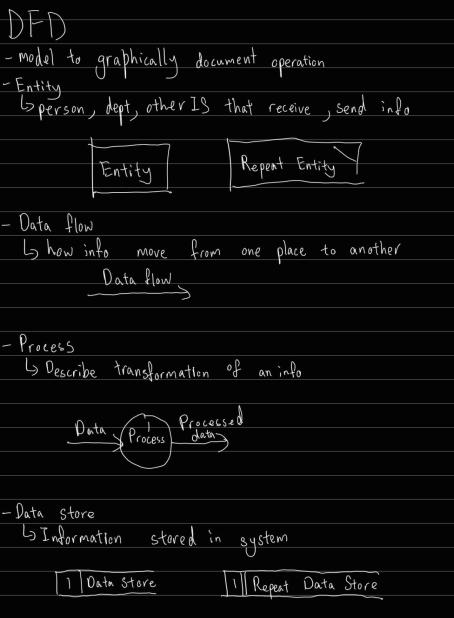
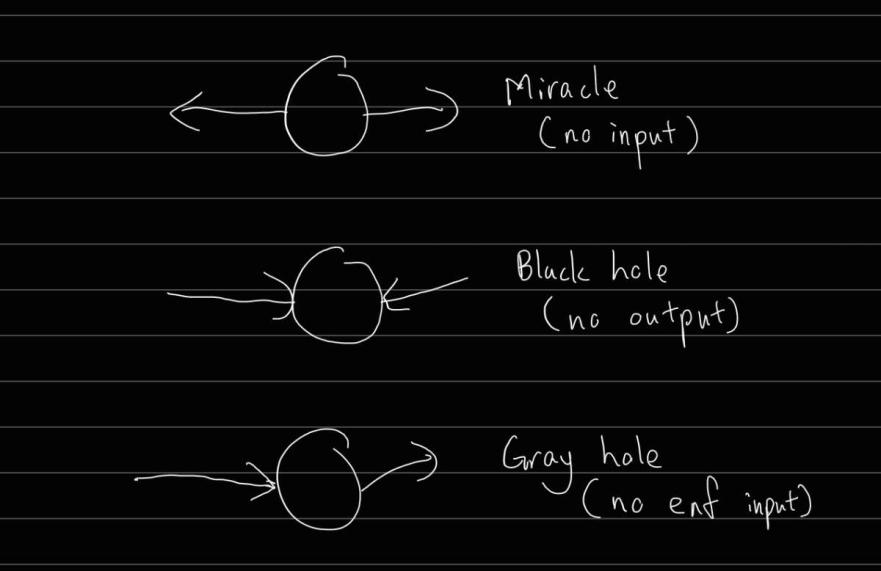
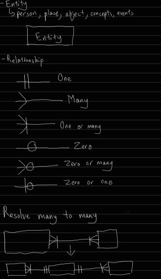

# SDLC
1. Request
2. Planning
3. Analysis
4. Design
5. Development
6. Implementation
7. Operation & Maintenance

# C2 System Planning

## System Request
> A formal request to give IT department job
### Causes
- Change in objective
- Got new objectives
- Current system got problem
- User's suggestion
### Result
- New system
- Enhanced system
### Sources
- Top management
  - Need new info
  - Need to meet new objective
- User's needs
  - Need new feature
  - Unhappy with current system
- External sources
  - Got new technology
  - New legal policy
- Existing system problem
- IT department find job for their own
### Types of Improvements
- Improve performance
- Better service
- Quality info
- Effective control
  - related to validation
- Reduce cost
  - current system maintenance cost too high

## Preliminary Investigation
- To gather info
- Done after system project is approved

## Feasibility Study
- Determine new system feasible or not
- Benefit > cost
- Identify objective
- Determine requirements
- Determine Scope
- Estimate cost & benefits
- Estimate time
- Identify constraints (budgets)

### Technical Feasibility
- Software, hardware, performance (are they doable)
- Issues
  - Can have many users?
  - Can process many inputs?
  - Can output fast enough?
  - Response time fast?

### Social and Operational Feasibility
- New structure can be used?
- Will it have extra cost? If so, can the benefits cover it?
- Issues
  - Employee
    - Skill
    - Motivation
  - Structural Changes
  - High costs
    - Direct
    - Indirect

### Economic Feasibility
- Idenitfy cost and benefit
- Issues
  - Technique: Technique used to compare correct or not
  - Selection: Use which options
  - Decision: Should the project be stopped

### Costs
- Hardware & Software
- Installation
- Development
- Personnel
- Operating
- Intangible
  - Learning curve
  - Incompatibility
  - Staff can't work well

### Benefits
- Tangible
  - Reduce operation cost
  - Reduce staff cost
  - Increase sales
  - Reduce stock holding
  - Reduce mistakes
  - Improve productivity
- Intangible
  - Company image
  - Customer satisfaction
  - Accurate management
  - Staff motivation
  - Updated info
  - Security
  - Faster response time

# C3 System Analysis I (Requiements Analysis)
- Defines required functionality

## Fact gathering
- From: End Users
- Quality: Analyst need know rule and flow in that area
- What
  - Rules
  - Processes
  - Work locations
  - User activities
  - Interfaces

## Fact Gathering Techniques
### Interview
- Face to face
- Meeting (formal)
- Documented feedback to user for confirmation
- Advantages
  - Read body language
  - People talk more freely
  - Build relationship
  - Carify facts easier
  - Can get cooperation
- Disadvantages
  - Waste money, time
  - Interviewer need to be skilled
  - Need to contact people to be interviewed

### Questionnaires
- Used when many users or international
- Used when anonymity is important
- Advantages
  - Answer at any time
  - Respond anonymously
  - Get response from large group of people
- Disadvantages
  - Hard to design
  - Cannot clarify questions
  - Not everyone will respond

### Observation
- Analyst watch the system in use
- Need make arrangements in advance
- Advantages
  - Offer new perspective to see the problem yourself
  - Cross-check
  - See environment
- Disadvantages
  - Waste time
  - Need understand procedure first
  - Workers get nervous under observation

### Existing Docs
- Analyse previous docs
- Advantage
  - Procedures are detailed
- Disadvantages
  - Docs can be outdated
  - Docs need to be selected carefully

### Joint Application Development
- A group of user together discuss requirements, issues and problems
- Workshop documented

### Background Research
- Review journals
- Attend meetings
- Visit similar places

### Prototyping
- Use 4GL / CASE tools
- Make it to user so they can provide further feedbacks
- Fast, productive

## Functional Requirements
- What the system need to provide
- Describe
  - Input
  - Output
  - Process
  - Data
- Eg.
  - Storage requirements
    - Fast retrieval
  - UI requirements
    - Auto fill
  - Processing Requirements
    - Accept orders
  - Control Requirements
    - Data validation

## Non-functional Requirements
- Eg.
  - Interface with other system
  - Audit trail records
  - Legal (license, law)
  - Archiving
    - after some time, save to somewhere else
  - Backup
    - make copy
  - Reliability
  - Usability
    - Learnability
      - how long to learn
    - Efficiency
      - how fast to perfomr
    - Memorability
      - how long they can remember
    - Errors
      - how many errors made
    - Satisfaction

# C4 System Analysis II (Fact Recording)
> A picture is worth a thousand words`
## Data Flow Diagram
- Help understand flow and process

- Rules
  - Process
    - Input must be transformed to output through process
    - Process need got number labeling
    - Verb + Noun
  - Data flow
    - Must have arrows
    - Label the arrows
  - Data Store
    - Must got number
  
  

## ERD

## DataBase Design Language
ENTITY(<u>PrimaryKey</u>, NormalField ,ForeignKey*)

# C5 System Design
- Show how system will fulfill what it is supposed to do
- Overall plan or model with specifications

## Importance
- Future maintenance
  - Provide roadmap & docs for maintenance staff
- Quality
  - Find out how the software should behave to have high quality
- Testing
  - Easier to test
  - You know what to test for
- Communication
  - Communication medium between designers of different sub-systems
- Implementation
  - Translate client's requirements into software

## Physical vs Logical Design
- Physical
  - System Design phase
  - Defines actual process of
    - Entering: UI
    - Verifying: Validation
    - Storing Data: DB
- Logical
  - System Analysis phase
  - Define functions & features
  - What must take place, not how do it

## Architectural Design
- Provide an overall picture for the objective
  - Have better dev process
- Show all the modules and control relationship between them
- To develop a modular program structure

### System Structure Diagram
- How different modules relate to each other in the whole system
- How control information flow between them

### Functional Decomposition Diagrams
- FDDs, structure charts
- Top down representation of a function/process
  - Can use DFD as a guyde
    - Diagram 0 as whole system
    - Low-level DFD as modules
- Break down system into sub-systems
- Used in
  - Requirements modeling
  - App development
- 3 Steps
  - Define system into main processes
  - Identify activities that need to run to do the process
  - Break the activities into smaller tasks

## User Interface Design
- How user interact with the system
  - Hardware
    - Keyboard
    - Mouse
    - Touchscreen
    - Scanner/Reader
  - Software
- Types of UI
  - Command Line Interface
  - Menu-Driven Interface
  - Improved Menu Interfaces
    - Pop-up
    - Pull-down & nested menus
  - Toolbar & Icon-based Interfaces
  - Form-based Interface
  - Natural Language Interaction
    - Allow user to enter questions and commands
    - Answer in natural language
    - Eg. Google Assistant
- UI Design Interfaces
  - Consistent Design
    - Similar operation activated in the same way
  - Familiarise Users
    - Use terms and concepts from experienced users
  - Guide users
    - Provide hints and tooltips
    - Give context-sensitive user guide and assistance
  - Reduce surprise
  - Enhance Recoverability
    - Let user recover from errors

### User Friendliness Characteristics
- Ease of Data Entry
  - Data entry screen in same logical error as the input form
  - Clearly Designed
  - Clear title of the fields
  - Provide data validation checks
- Meaningful error message
  - Report errors
    - simple
    - unique
  - Suggest actions
- Help Facilities
  - On-screen help
  - Hypertext & Hypermedia
  - Context sensitive
    - Provide help when user unsure or unable to perform something or made an error
    - Provide example how the command can be used
    - Suggest correct alternative that the user has used
- Consistent with other modules
  - All modules look, feel, operate in the same way
  - Same shortcut key to do the same thing
  - Reduced training time
- Adherence to Industrial Standards
  - Use commands & techniques that are used in other softwares in the same industry
  - Take advantage of "transferable" skills, increase productivity
- Escapability
  - Let user escape from their mistakes
  - Undo, Delete
- Other features
  - Pull-down list
    - A list of accepted values provided to the user to choose from
  - Default values
    - Set default values when the data of the fields can be predicted

### Input Design
- Produce cost effective method of input
- Achieve highest level of accuracy
- Ensure input acceptable and understood by staff and users
- Consideration
  - Volume
    - If large volume, use automated
  - Frequency
    - If low frequency, can use keyboard
  - Medium
    - Use what
  - Accuracy
    - Do checks
  - Speed

## Verification and Validation
- Verification
  - Before input into system
  - Use human eyes
- Validation
  - During input
  - Check for accuracy before process the data

### Types of Validation
- Format Check
  - Input follow a certain format
- Existence Check
  - Does the record exist in DB
- Null Value Check
  - Is the input field empty
- Data Type Check
  - Data type, alphabets, integers
- Size Check
  - How many characters
- Limit Check
  - Input *less than* or *more than* a limit
- Range Check
  - Input between a *min* and a *max* number

## Output Design
### Factors affecting
- Purpose
- Frequency
- Volume
- Output Medium
- Content and Format
### Types
- Screen
- Audio
- Printer, plotter
- Computer Output Microfilm
- Mobile Devices
- Others
  - ATM, POS terminals

## Reports
### Guidelines for Creating
- Functional Area
  - Designed for its own dept.
  - Sales Analysis Report for Sales Dept
- Level of Staff
  - Designed for the staff at that level
- Purpose of Report
  - Contain informations that are relevant to the report

### Types
- Detail Rerports (Sorted, Categorized)
  - Contain *every single items*
- Summary Reports
  - Total and Subtotals
  - Can be graphs or charts
- Exception Reports
  - *Filtered items* using certain criteria

### Attributes of a Good Report
- Appropriate Report Title
  - Good name
  - Revision / Version
  - Length (not too long)
- Pleasing Layout
  - Labels for all data
  - Good layout
  - Appropriate spacing
- Meaningful Context
  - Presentation
    - Presented in a way useful to the users
  - Relevant
    - Put in relevant data only
- Others
  - If multi page and display on screen, provide *navigation*
  - Tell user report has finished
